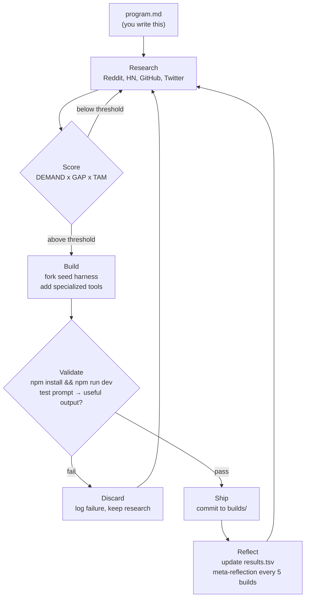
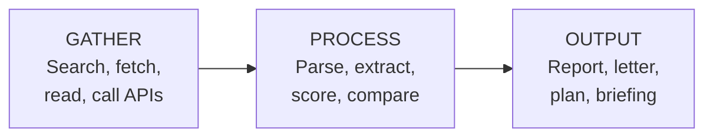

# agent-factory

An autonomous agent that researches real problems, then builds specialized open-source agents to solve them.

Inspired by [Karpathy's autoresearch](https://github.com/karpathy/autoresearch) — same autonomous loop, different domain. Instead of optimizing `val_bpb` on a training script, this agent discovers pain points from the wild, designs multi-tool agent architectures, validates them, and ships them as standalone repos.

You write `program.md`. The agent does everything else — overnight, unattended.

## How It Works



The agent runs in a loop. Each cycle it discovers problems real people have, scores them against a quality threshold, builds agents on the seed harness, and ships or discards. Research compounds — every session builds on the last.

## The Karpathy Pattern

| autoresearch | agent-factory |
|---|---|
| GPU | API key ring |
| `train.py` | seed harness + specialized tools |
| `val_bpb` metric | Venture Score (max 6) + TAM |
| Composite score | `venture x TAM` — threshold gate |
| git reset on failure | discard build, keep research |
| "NEVER STOP" | "NEVER STOP" |
| Simplicity criterion | Right-size the tool chain |

## Scoring

Every idea is scored before building:

**Venture Score** (max 6, 1 point each):
- SIGNAL: Found 3+ people asking for this
- GAP: No good free tool solves this today
- FEASIBLE: Can be built on the seed harness
- BOOTS: `npm install && npm run dev` works
- WORKS: Test prompt returns useful output
- README: Clear docs explaining what, why, how

**TAM** (Total Addressable Market, log scale):

| TAM | Users | Example |
|-----|-------|---------|
| 0 | <100K | Niche developer tool |
| 1 | 100K–1M | npm package users |
| 2 | 1M–10M | GitHub repo maintainers |
| 3 | 10M–100M | Freelancers, small business owners |
| 4 | 100M–1B | Workers, homeowners, consumers |
| 5 | 1B+ | Every internet user |

**Composite Score** = Venture x TAM. New ideas must beat the current highest composite to enter the build queue. This forces the agent to keep raising the bar.

## Agent Architecture

Every built agent follows **GATHER → PROCESS → OUTPUT**:



Each tool does one thing well. Use as many as the problem needs — no artificial cap.

## Repo Structure

```
agent-factory/
├── program.md              # Agent instructions (you edit this)
├── run.sh                  # Overnight runner — restarts on context limits
├── .env.example            # API keys template
├── seed/                   # Base agentic harness (read-only)
│   ├── lib/tools/          # 7 built-in tools
│   ├── lib/orchestrator.ts # Agentic loop
│   └── config.ts           # System prompt + model config
├── research/               # Generated per session (gitignored)
│   ├── research-log.md     # All findings, scored
│   ├── summary.md          # Compact cumulative history
│   └── archive/            # Past session logs
├── builds/                 # Shipped agents
│   └── <agent-name>/       # Each is a standalone Next.js app
├── results.tsv             # All attempts — shipped/failed (gitignored)
├── build-queue.md          # Next problems to build (gitignored)
└── .gitignore
```

Research data (`research/`, `results.tsv`, `build-queue.md`) is generated per session and gitignored. The public repo contains the system (`program.md`, `seed/`, `run.sh`) and the shipped agents (`builds/`).

## Quick Start

```bash
# 1. Clone
git clone https://github.com/Dominien/agent-factory
cd agent-factory

# 2. Configure keys
cp .env.example .env
# Add your Anthropic/OpenAI key + Composio key

# 3. Run the loop
./run.sh
# Or run manually:
# claude -p --dangerously-skip-permissions "Read program.md fully. Read seed/README.md. Check .env, results.tsv. Begin the loop. NEVER STOP."
```

The agent will:
1. Research problems from Reddit, HN, GitHub, Twitter
2. Score each for demand, gap, feasibility, and TAM
3. Build agents that pass the threshold
4. Ship them to `builds/`, commit, and keep going

## Seed Harness Tools

The seed harness ships with 7 tools:

| Tool | Key Required | Purpose |
|---|---|---|
| `web_search` | — | DuckDuckGo search |
| `web_fetch` | — | Fetch + extract readable content from any URL |
| `file_write` | — | Save reports and artifacts to disk |
| `file_read` | — | Read local files |
| `composio_search_tools` | `COMPOSIO_API_KEY` | Discover any of 250k+ API tools |
| `composio_execute_tool` | `COMPOSIO_API_KEY` | Execute a discovered tool |
| `composio_manage_connections` | `COMPOSIO_API_KEY` | Manage auth connections |

A single `COMPOSIO_API_KEY` replaces individual API keys. Built agents discover and use tools at runtime via Composio. The harness supports multiple LLM providers — OpenRouter (default), Anthropic, OpenAI, and Ollama.

## What Gets Produced

After an overnight session:
- **10-20 documented findings** — scored, sourced problem research
- **3-5 build attempts** — logged in `results.tsv`
- **1-5 shipped agents** — self-contained in `builds/`
- **Meta-reflections** — patterns, failures, adjusted strategy

## Design Principles

1. **Local-first** — No databases, no hosted state. Files + git.
2. **Right-size tools** — As many as the problem needs. Each does one thing well.
3. **Self-contained** — Each agent: clone, add `.env`, `npm run dev`. Done.
4. **Research is a product** — Even failed builds produce documented knowledge.
5. **Threshold ratchet** — The bar keeps rising. Forces better ideas over time.
6. **Ship imperfect** — Working beats perfect. Document limitations, move on.

## Customizing

Edit `program.md` to change:
- **Where to research** — Add subreddits, forums, data sources
- **Scoring weights** — Adjust TAM scale, composite formula
- **Build constraints** — Change quality bar, diversity rules
- **Anti-patterns** — Block categories the agent gravitates toward

The agent reads `program.md` at session start and follows it autonomously.

## License

MIT
